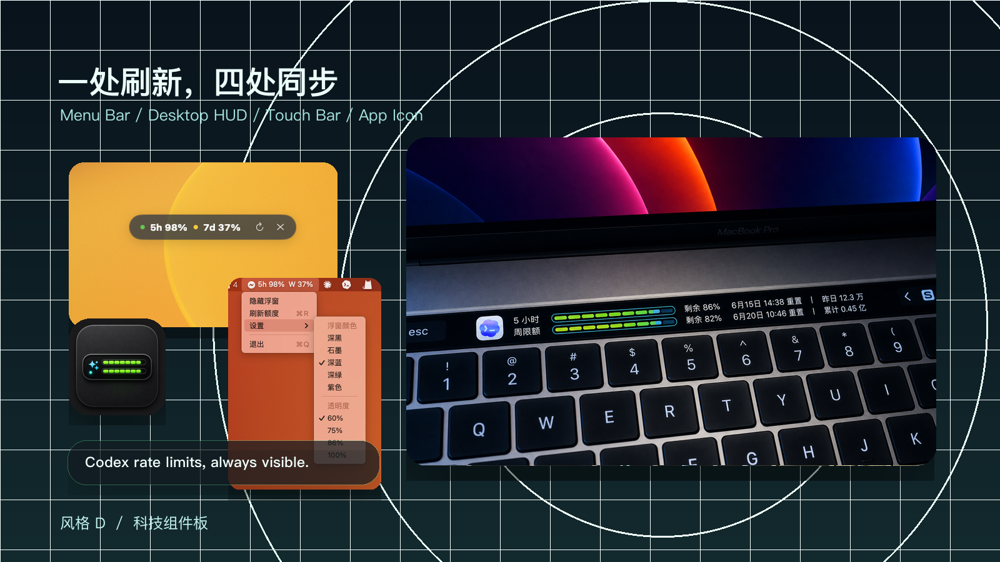
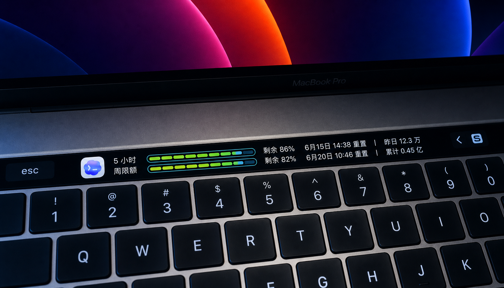

# TouchBarCodexToken

TouchBarCodexToken 是一个 macOS 菜单栏 + 桌面 HUD 小工具，用本机 Codex app-server 读取 Codex 额度，并把 5 小时额度和周额度显示在桌面小浮窗和 Touch Bar 上。



Touch Bar 清晰细节：



它不抓网页，也不需要你填写 API Key。应用会启动本机：

```bash
/Applications/Codex.app/Contents/Resources/codex app-server --listen stdio://
```

然后通过 JSON-RPC 调用：

```text
account/rateLimits/read
```

## 功能

- 桌面置顶小 HUD：显示 `5h xx%`、`7d xx%`、刷新图标和退出图标。
- 菜单栏状态：显示 5 小时额度和周额度的剩余百分比。
- Touch Bar：点击 HUD 后尝试显示两行分段电量条。
- 同步状态：菜单栏、HUD 和 Touch Bar 使用同一份额度状态。
- 自动联动 Codex：检测到 Codex 启动后显示 HUD，Codex 退出后自动退出。
- 自动拉起：首次运行 app 后会注册本机 LaunchAgent，之后 Codex 启动时自动打开额度条。
- 刷新保护：刷新失败时保留旧数据，不清空已有额度。
- 外观设置：菜单栏里可修改 HUD 颜色和透明度。
- 本地优先：只调用本机 Codex app-server，不保存账号、密钥或授权码。

## 兼容性

### Mac 机型

| 机型 | 支持情况 | 说明 |
| --- | --- | --- |
| Intel Mac | 支持 | 当前发布的 DMG 是 `x86_64` 构建，适合 Intel 芯片 Mac，包括 2016-2019 款带 Touch Bar 的 MacBook Pro。 |
| Apple Silicon Mac | 支持 | M1 / M2 / M3 / M4 系列 Mac 可通过 Rosetta 2 运行当前 Intel 版应用；首次打开时系统可能提示安装 Rosetta。 |
| 无 Touch Bar 的 Mac | 支持 | 桌面 HUD 和菜单栏额度显示可以正常使用，只是不会显示 Touch Bar 额度条。 |

### Touch Bar

Touch Bar 不是必需硬件。

- 有 Touch Bar 的 Mac：可以使用桌面 HUD、菜单栏和 Touch Bar 额度条。
- 没有 Touch Bar 的 Mac：可以正常使用桌面 HUD 和菜单栏，Touch Bar 相关功能会自然不可见。

### 系统和依赖

- macOS 11 Big Sur 或更新版本。
- 已安装 `/Applications/Codex.app`。
- 本机 Codex app-server 可用。

## 界面

HUD 默认是一个小胶囊浮窗，放在屏幕上方附近：

```text
● 5h 85%   ● 7d 80%   ↻   ×
```

- `↻`：刷新额度。
- `×`：退出应用。
- 状态点为绿色、黄色或红色，表示剩余额度充足、偏低或较低。
- 如果读取失败且没有旧数据，状态点会显示红色。
- 鼠标悬停在 HUD 上可以看到当前状态说明。

## Touch Bar

点击桌面 HUD 主体区域时，应用会尝试让 macOS 显示 Touch Bar 额度条。

Touch Bar 内容包括：

- Codex 官方图标。
- `5 小时` 额度分段电量条。
- `周限额` 分段电量条。
- 剩余百分比。
- 重置时间。
- 本地 token 消耗统计：`昨日` 和 `累计`。

注意：macOS 的公开 Touch Bar API 与当前前台 App / first responder 绑定。切回 Codex 输入后，Touch Bar 可能会被 Codex 自己接管，这是系统限制。

## 菜单栏

点击菜单栏图标可以打开菜单：

- `显示浮窗` / `隐藏浮窗`
- `刷新额度`
- `设置`
  - `浮窗颜色`
    - 深黑
    - 石墨
    - 深蓝
    - 深绿
    - 紫色
  - `透明度`
    - 60%
    - 75%
    - 86%
    - 100%
- `退出`

设置会保存到 `UserDefaults`，下次启动继续生效。

## 安装和运行

### 方式一：构建 app

```bash
scripts/build-app.sh
```

构建成功后会生成：

```text
build/TouchBarCodexToken.app
```

双击这个 app，或运行：

```bash
open build/TouchBarCodexToken.app
```

首次运行后，应用会在当前用户的 `~/Library/LaunchAgents` 下注册一个轻量启动器：

```text
com.jackchen.TouchBarCodexToken.CodexLauncher.plist
```

它每 5 秒检查一次 Codex 是否正在运行。如果 Codex 已启动而额度条未运行，就自动打开 `TouchBarCodexToken.app`。如果你在 Codex 仍运行时手动退出额度条，本轮 Codex 会话内不会被自动拉起；Codex 完全退出后会清除这个手动退出状态。

### 方式二：打包 DMG

```bash
scripts/package-dmg.sh
```

打包成功后会生成：

```text
dist/TouchBarCodexToken-0.1.4.dmg
```

分享给其他人时，推荐上传这个 DMG 到 GitHub Releases。当前项目没有 Apple Developer 签名和公证，首次打开时 macOS 可能提示无法验证开发者；用户可以在 Finder 中右键点击 app，选择“打开”，再确认一次。

### 方式三：开发期直接运行

```bash
swift run
```

## 要求

见上方“兼容性”章节。

## 构建说明

项目使用 Swift / AppKit 实现。

常规构建走 SwiftPM：

```bash
swift build -c release
```

如果本机 Command Line Tools 的 SwiftPM SDK 探测失败，`scripts/build-app.sh` 会 fallback 到 `swiftc -sdk` 直接编译。

### 重新生成 App 图标

项目图标源图在 `Resources/AppIcon.png`，macOS 图标文件在 `Resources/AppIcon.icns`。

```bash
scripts/make-app-icon.py
```

脚本会为 Finder 列表视图常用的小尺寸层生成专门的简化图标，并用标准 ICNS 写入器输出，避免小图标被直接缩小或被系统读成杂色噪点。

## 更新记录

### 0.1.4

- 新增 LaunchAgent 启动器，首次运行后可在 Codex 启动时自动打开额度条。
- 新增 `scripts/package-dmg.sh`，可生成用于分享安装的 DMG。
- README 增加 Intel Mac、Apple Silicon Mac、无 Touch Bar Mac 的兼容性说明。
- Touch Bar 增加本地 token 消耗统计，显示 `昨日` 和 `累计` 用量。
- 重置时间统一显示为 `M月d日 HH:mm 重置`，让 5 小时额度和周额度两行更容易对齐阅读。
- 本地 token 统计改为后台读取，避免刷新时桌面 HUD 和菜单栏短暂卡住。
- 更新 README 宣传图，并新增一张更清晰的 Touch Bar 细节图。

### 0.1.2

- 修正 Finder 详情列表小图标模式下图标显示成彩色噪点的问题。
- 调整 `scripts/make-app-icon.py`，改用 Pillow 的标准 ICNS 写入器生成兼容的小尺寸图层。

### 0.1.1

- 修正 Finder 列表等小尺寸场景下 App 图标显示不清楚的问题。
- 新增 `scripts/make-app-icon.py`，用于重新生成带专门小尺寸图层的 `AppIcon.icns`。

## 隐私

TouchBarCodexToken 不保存密码、API Key、授权码或账号凭据。额度数据来自本机 Codex app-server，并只显示在本机 UI 中。

## 许可证

MIT License
